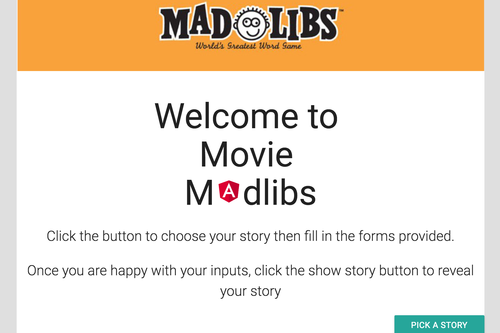

Angular MadLibs
=================
### Description

Objective: Develop a crowd-sourced or choose your destination tool for users by leveraging Mad Libs as the base. Users simply choose a story template and fill out the form with their personalized language and quickly create their unique version of a classic story.

Goal: Design-your-own story with Mad Libs and see where your creativity takes you and your followers.

Build/Code: Mad libs was developed with Angular, JavaScript, HTML, and CSS.

### Instructions

After cloning the repo, you'll need to be able to host a local server for it work.
<https://www.npmjs.com/package/http-server> will do the trick

Once you get the index.html to render, just follow instructions on the page.

Image:

